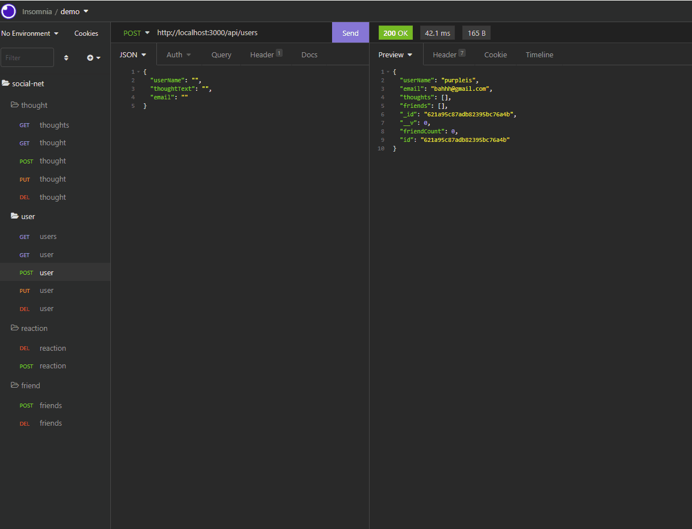
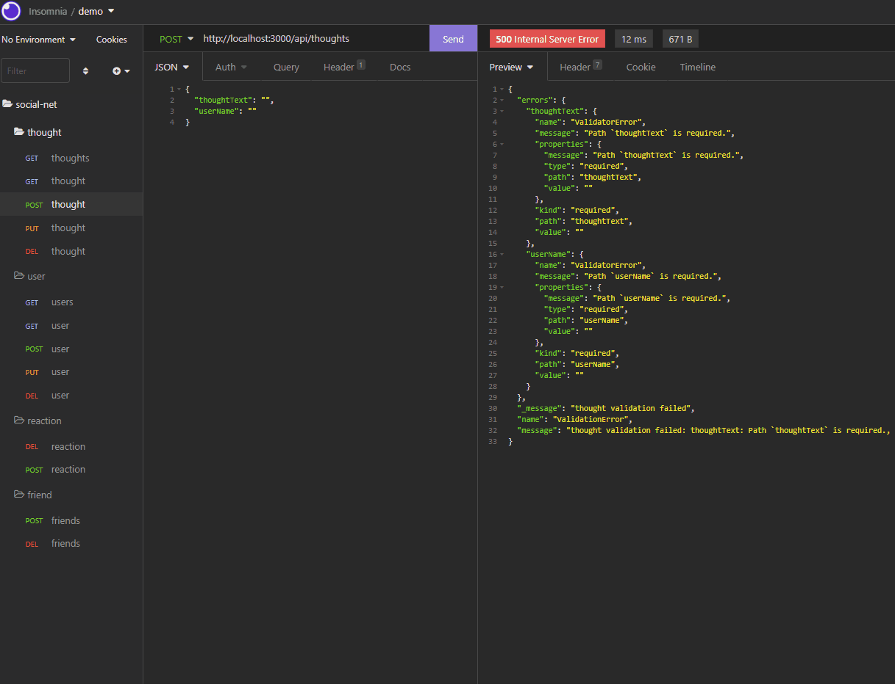
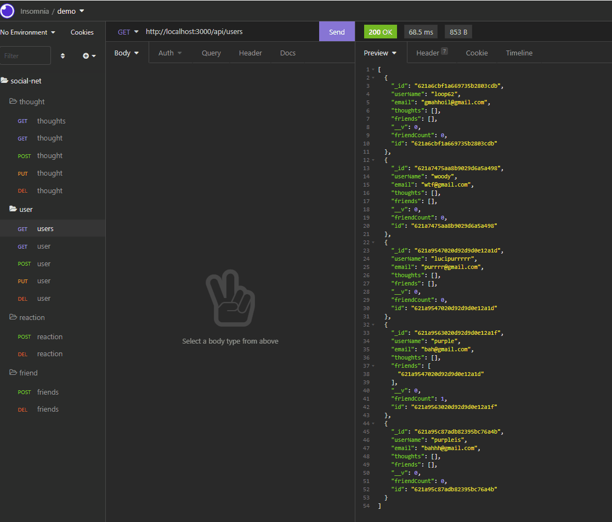
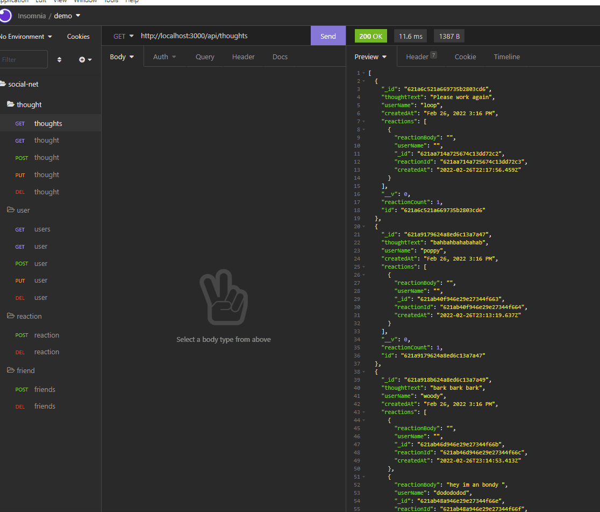

# social-network-api

## Description
The backend to a typical social media app with usernames, user emails, thoughts, and reactions. 
It also has the ability to update usernames and thoughts.
It can also delete user friends, reactions, and user.

## Installation
npm i
Make sure that Node.js is installed.
Install insomnia on your computer if you want to test it out 

## Instructions 
Create a GET, POST, PUT, or DELETE file and add the proper url in insomnia bar above adn hit SEND. 
You can add text in the body with JSON.

## Technologie
Javascript, mongo, mongoose 

## Contributors
Brett, Franzt, Hannah

## Demo
### Users

### Thoughts

### Friends

### Reactions

## Licence 
none
